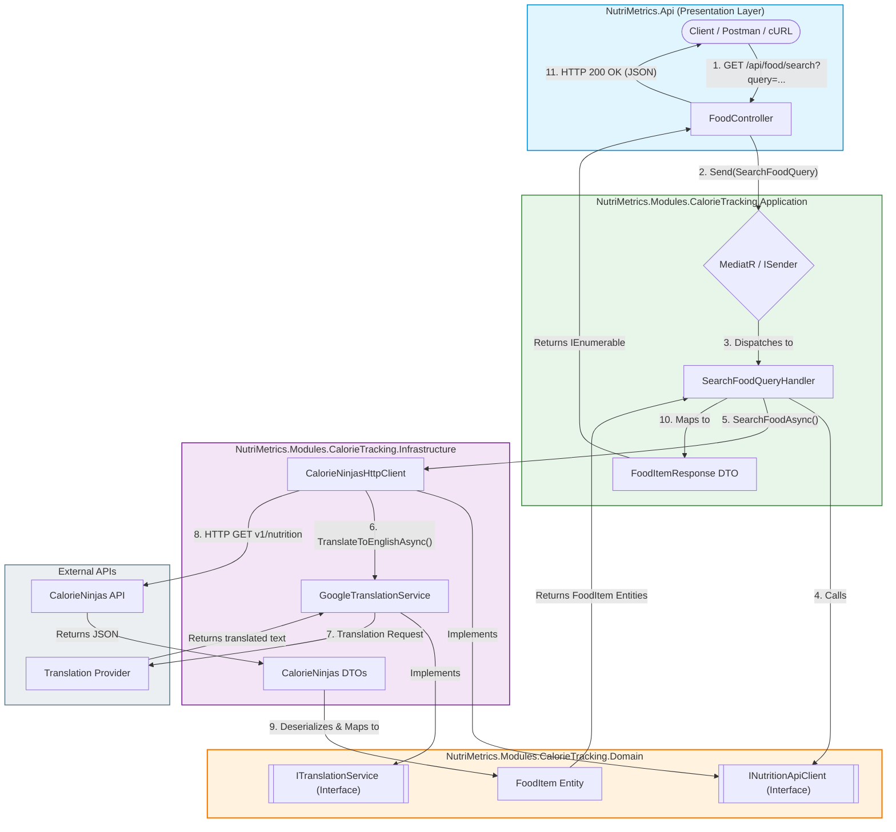

# 🥗 NutriMetrics - Multi-User Calorie Tracking API

[](https://dotnet.microsoft.com/)
[](#architecture--clean-design)
[](#architecture--clean-design)
[](#-authentication--authorization)
[](#-api-documentation-swagger)
[](LICENSE)

---

## 📖 Overview

**NutriMetrics** is a modular, multi-user platform built on **.NET 10** for calorie and nutritional tracking.

### Key Features

- ✅ **Multi-User Support**: Authenticated users with JWT-based authorization
- ✅ **Calorie Tracking**: Search foods by natural language (Spanish support)
- ✅ **Authentication**: Register, login, and JWT token management
- ✅ **Data Isolation**: Each user's data is isolated in the database
- ✅ **Clean Architecture**: Domain-Driven Design with CQRS
- ✅ **Modular**: Separate modules for Identity and CalorieTracking
- ✅ **REST API**: Standards-compliant endpoints with authorization

---

## 🏗 Architecture & Clean Design

The project strictly follows **Clean Architecture** and **CQRS**, ensuring the domain core remains completely independent of infrastructure concerns.

### Design Pattern
- **CQRS + MediatR**: Commands and Queries separation for clear intent
- **Clean Architecture**: Domain → Application → Infrastructure layers
- **Module-Based**: Independent modules with their own layers

### Modules

1. **Identity Module** (`src/Modules/Identity/`)
   - User registration and authentication
   - JWT token generation and validation
   - User and Role management
   - Domain: `User`, `Role` entities
   - Application: `RegisterCommand`, `LoginCommand`
   - Infrastructure: `IdentityDbContext`, `AuthService`, `JwtTokenService`

2. **CalorieTracking Module** (`src/Modules/CalorieTracking/`)
   - Food item management
   - External nutrition API integration
   - Multi-user food tracking
   - Domain: `FoodItem` entity with `UserId`
   - Application: `AddFoodItemCommand`, `SearchFoodQuery`
   - Infrastructure: `CalorieTrackingDbContext`, `CalorieNinjasHttpClient`

### Request Flow — Search Food Example



### External Services

The module communicates with external providers through abstractions defined in the Domain layer, keeping the application independent from specific providers:

- **GoogleTranslateFreeApi** — implements `ITranslationService`
- **CalorieNinjas API** — implements `INutritionApiClient`

---

## 📂 Solution Structure

```text
NUTRI_METRICS/
│
├── src/
│   ├── Modules/
│   │   ├── Identity/
│   │   │   ├── NutriMetrics.Modules.Identity.Domain/          # User, Role entities
│   │   │   ├── NutriMetrics.Modules.Identity.Application/     # RegisterCommand, LoginCommand
│   │   │   └── NutriMetrics.Modules.Identity.Infrastructure/  # DbContext, Services, Migrations
│   │   │
│   │   └── CalorieTracking/
│   │       ├── NutriMetrics.Modules.CalorieTracking.Domain/          # FoodItem entity
│   │       ├── NutriMetrics.Modules.CalorieTracking.Application/     # CQRS Queries, Handlers & DTOs
│   │       │   └── FoodItems/
│   │       │       └── Queries/
│   │       │           └── SearchFood/
│   │       │               ├── FoodItemResponse.cs
│   │       │               └── SearchFoodQuery.cs
│   │       └── NutriMetrics.Modules.CalorieTracking.Infrastructure/  # DbContext, Repositories, external clients, Migrations
│   │
│   ├── NutriMetrics.Api/                       # Entry Point Host & Presentation Layer
│   │   ├── Controllers/
│   │   │   └── FoodController.cs
│   │   ├── Properties/
│   │   ├── appsettings.Development.json
│   │   ├── appsettings.json
│   │   ├── NutriMetrics.Api.csproj
│   │   ├── NutriMetrics.Api.http
│   │   └── Program.cs
│   │
│   └── Shared/                                 # Shared Kernel & Infrastructure Assets
│       ├── NutriMetrics.Shared.Domain/
│       └── NutriMetrics.Shared.Infrastructure/
│
├── NutriMetrics.slnx
└── README.md
```

---

## 🗄️ Database Schema

### Single Database: `nutrimetrics_calorietracking`

Both authentication and business logic use the same MySQL database for simplified management and deployment, split into separate `DbContext`s per module.

```sql
-- Identity Tables (created by Identity module)
AspNetUsers          -- User accounts
AspNetRoles          -- User roles
AspNetUserRoles      -- User-Role relationships
AspNetUserClaims     -- User claims
AspNetRoleClaims     -- Role claims
AspNetUserLogins     -- External login providers
AspNetUserTokens     -- Token management

-- Business Tables (created by CalorieTracking module)
FoodItems            -- Tracked food items
```

### Connection String

**File**: `src/NutriMetrics.Api/appsettings.json`

```json
{
  "ConnectionStrings": {
    "Default": "Server=localhost;Port=3306;Database=nutrimetrics_calorietracking;User=root;Password=your_pass_here;"
  }
}
```

Both `IdentityDbContext` and `CalorieTrackingDbContext` use this same connection string.

---

## 🔐 Authentication & Authorization

### Overview

NutriMetrics uses **ASP.NET Core Identity** with **JWT Bearer tokens** for stateless API authentication.

```
Register/Login → JWT Token → Protected Endpoints with [Authorize]
```

### User Registration

**Endpoint**: `POST /api/auth/register`

**Request**:
```json
{
  "email": "user@example.com",
  "password": "SecurePass123",
  "passwordConfirm": "SecurePass123"
}
```

**Response**:
```json
{
  "success": true,
  "message": "User registered successfully",
  "token": "eyJhbGciOiJIUzI1NiIsInR5cCI6IkpXVCJ9...",
  "userId": "550e8400-e29b-41d4-a716-446655440000"
}
```

**Validation**:
- Password minimum 8 characters
- Passwords must match
- Email must be unique

### User Login

**Endpoint**: `POST /api/auth/login`

**Request**:
```json
{
  "email": "user@example.com",
  "password": "SecurePass123"
}
```

**Response**: Same as registration (returns JWT token)

### Token Verification

**Endpoint**: `GET /api/auth/verify` (requires `[Authorize]`)

**Response**:
```json
{
  "userId": "550e8400-e29b-41d4-a716-446655440000",
  "email": "user@example.com"
}
```

### Protected Endpoints

All food-related endpoints require authorization:

```csharp
[Authorize]
[ApiController]
[Route("api/[controller]")]
public class FoodController : ControllerBase { ... }
```

Add the JWT token to requests:
```
Authorization: Bearer <your_jwt_token>
```

### JWT Configuration

**File**: `src/NutriMetrics.Api/appsettings.json`

```json
{
  "Jwt": {
    "Secret": "your-very-long-secret-key-minimum-32-characters-required-change-in-production",
    "Issuer": "NutriMetrics.Api",
    "Audience": "NutriMetrics.Client",
    "ExpirationMinutes": 60
  }
}
```

**Important**:
- Secret must be ≥ 32 characters
- Change the Secret in production
- Token expires after 60 minutes (configurable)

### Token Claims

JWT tokens include:
- `sub` (NameIdentifier): User ID (Guid)
- `email`: User email
- `iat` (IssuedAt): Token creation time
- `exp` (Expiration): Token expiration time

Extract from token in handlers:
```csharp
var userId = httpContext.User.FindFirst(ClaimTypes.NameIdentifier)?.Value;
var email = httpContext.User.FindFirst(ClaimTypes.Email)?.Value;
```

### Password & Lockout Policy

Configured in `IdentityModule.cs`:

- **Password**: minimum 8 characters, no uppercase/digit/special character required, unique emails enforced
- **Lockout**: 5 minute duration, 5 failed attempts before lockout, enabled for new users

---

## 🔍 Multi-User Data Isolation

Each `FoodItem` contains a `UserId` field linking it to the authenticated user.

```csharp
public class FoodItem
{
    public Guid Id { get; private set; }
    public Guid UserId { get; private set; }  // Links to AspNetUsers.Id
    public string Name { get; private set; }
    public double Calories { get; private set; }
    // ... nutritional data
    public DateTime CreatedAt { get; private set; }
}
```

**Handlers automatically extract `UserId` from the JWT**:
```csharp
var userId = httpContext.User.FindFirst(ClaimTypes.NameIdentifier)?.Value;
var foodItem = new FoodItem(userId, name, calories, ...);
```

Queries always filter by the current user:
```csharp
var userFoodItems = await repository.GetByUserAsync(userId, cancellationToken);
```

---

## 🗄️ Entity Framework Core & Migrations

### DbContexts

#### 1. IdentityDbContext
**Location**: `src/Modules/Identity/NutriMetrics.Modules.Identity.Infrastructure/Database/IdentityDbContext.cs`

Manages Identity tables (Users, Roles, Claims, etc.)

```csharp
services.AddDbContext<IdentityDbContext>(options =>
    options.UseMySql(connectionString, serverVersion)
);
```

#### 2. CalorieTrackingDbContext
**Location**: `src/Modules/CalorieTracking/NutriMetrics.Modules.CalorieTracking.Infrastructure/Database/CalorieTrackingDbContext.cs`

Manages business entities (FoodItems, etc.)

```csharp
services.AddDbContext<CalorieTrackingDbContext>(options =>
    options.UseMySql(connectionString, serverVersion)
);
```

### Migrations

Migrations are organized by module:

**Identity**: `src/Modules/Identity/NutriMetrics.Modules.Identity.Infrastructure/Database/Migrations/`
- `20260722004255_InitialIdentity.cs` — Creates AspNetUsers, AspNetRoles tables

**CalorieTracking**: `src/Modules/CalorieTracking/NutriMetrics.Modules.CalorieTracking.Infrastructure/Database/Migrations/`
- `20260721235752_InitialCreate.cs` — Initial schema
- `20260722001501_CreateFoodItemsTable.cs` — FoodItems table
- `20260722004320_AddUserIdToFoodItems.cs` — Adds UserId column for multi-user support

### Creating Migrations

```bash
# CalorieTracking
dotnet ef migrations add MigrationName \
  --project src/Modules/CalorieTracking/NutriMetrics.Modules.CalorieTracking.Infrastructure \
  --startup-project src/NutriMetrics.Api \
  --context CalorieTrackingDbContext

# Identity
dotnet ef migrations add MigrationName \
  --project src/Modules/Identity/NutriMetrics.Modules.Identity.Infrastructure \
  --startup-project src/NutriMetrics.Api \
  --context IdentityDbContext \
  --output-dir Database/Migrations
```

### Applying Migrations

```bash
# CalorieTracking
dotnet ef database update \
  --startup-project src/NutriMetrics.Api \
  --context CalorieTrackingDbContext

# Identity
dotnet ef database update \
  --startup-project src/NutriMetrics.Api \
  --context IdentityDbContext
```

Or apply to a specific migration:
```bash
dotnet ef database update 20260722004255_InitialIdentity \
  --startup-project src/NutriMetrics.Api \
  --context IdentityDbContext
```

### Reverting Migrations

**Remove last migration** (without applying to DB):
```bash
dotnet ef migrations remove \
  --project src/Modules/CalorieTracking/NutriMetrics.Modules.CalorieTracking.Infrastructure \
  --startup-project src/NutriMetrics.Api \
  --context CalorieTrackingDbContext
```

**Revert database** to a previous state:
```bash
dotnet ef database update 20260722001501_CreateFoodItemsTable \
  --startup-project src/NutriMetrics.Api \
  --context CalorieTrackingDbContext
```

### Entity Configuration

Entity configurations use the **Fluent API** in dedicated files under `Database/Configurations/`.

Example — `FoodItemConfiguration`:
```csharp
public class FoodItemConfiguration : IEntityTypeConfiguration<FoodItem>
{
    public void Configure(EntityTypeBuilder<FoodItem> builder)
    {
        builder.HasKey(f => f.Id);
        builder.Property(f => f.UserId).IsRequired();
        builder.HasIndex(f => f.UserId);
        builder.Property(f => f.Name).HasMaxLength(255).IsRequired();
        builder.Property(f => f.CreatedAt)
            .HasDefaultValueSql("CURRENT_TIMESTAMP(6)");
    }
}
```

### Key EF Core Features Used

| Feature | Usage |
|---------|-------|
| **Value Objects** | DateTime defaults with `HasDefaultValueSql` |
| **Fluent API** | Entity configurations in dedicated files |
| **Indexes** | `HasIndex(f => f.UserId)` for query performance |
| **Foreign Keys** | Identity relationships (implicit) |
| **Seeding** | Could be added in migrations if needed |
| **Change Tracking** | Automatic timestamp updates |

---

## 🚀 Getting Started

### Prerequisites

- **.NET SDK 10.0** or higher
- **MySQL 8.0** or higher
- **PowerShell** or **Bash** terminal

### Installation

1. **Clone repository**
   ```bash
   git clone https://github.com/yourusername/nutri_metrics.git
   cd nutri_metrics
   ```

2. **Configure database** in `src/NutriMetrics.Api/appsettings.json`
   ```json
   {
     "ConnectionStrings": {
       "Default": "Server=localhost;Port=3306;Database=nutrimetrics_calorietracking;User=root;Password=your_pass_here;"
     }
   }
   ```

3. **Apply migrations**
   ```bash
   dotnet ef database update --startup-project src/NutriMetrics.Api --context CalorieTrackingDbContext
   dotnet ef database update --startup-project src/NutriMetrics.Api --context IdentityDbContext
   ```

4. **Run the API**
   ```bash
   dotnet run --project src/NutriMetrics.Api/NutriMetrics.Api.csproj
   ```

   API will be available at: `http://localhost:5162`

### Building & Testing

```bash
dotnet build

# View current migrations
dotnet ef migrations list --startup-project src/NutriMetrics.Api --context CalorieTrackingDbContext

# Check migration status
dotnet ef database info --startup-project src/NutriMetrics.Api --context CalorieTrackingDbContext
```

---

## 📊 API Endpoints

### Authentication
```
POST   /api/auth/register   - Register new user
POST   /api/auth/login      - Login and get JWT token
GET    /api/auth/verify     - Verify token validity [Authorize]
```

### Food Items
```
POST   /api/food            - Add food item [Authorize]
GET    /api/food/search?q=  - Search foods by query [Authorize]
```

### Example — Search Food

**Request**
```http
GET /api/food/search?query=2 manzanas y 100g de pechuga de pollo
```

**Response**
```json
[
  {
    "name": "apple",
    "calories": 94.6,
    "protein": 0.5,
    "fat": 0.3,
    "carbohydrates": 25.1,
    "servingSize": 182
  },
  {
    "name": "chicken breast",
    "calories": 165,
    "protein": 31,
    "fat": 3.6,
    "carbohydrates": 0,
    "servingSize": 100
  }
]
```

> Response values depend on the data returned by the external nutrition provider.

---

## 📝 Full Configuration Reference

```json
{
  "ConnectionStrings": {
    "Default": "Server=localhost;Port=3306;Database=nutrimetrics_calorietracking;User=root;Password=your_pass_here;"
  },
  "Jwt": {
    "Secret": "your-very-long-secret-key-minimum-32-characters-required-change-in-production",
    "Issuer": "NutriMetrics.Api",
    "Audience": "NutriMetrics.Client",
    "ExpirationMinutes": 60
  },
  "CalorieNinjas": {
    "ApiKey": "YOUR_CALORIE_NINJAS_API_KEY_HERE"
  },
  "Logging": {
    "LogLevel": {
      "Default": "Information",
      "Microsoft.AspNetCore": "Warning"
    }
  }
}
```

---

## 🔗 Dependencies

**Core Framework**
- ASP.NET Core 10.0
- Entity Framework Core 8.0.2
- Pomelo.EntityFrameworkCore.MySql 8.0.2

**Authentication**
- Microsoft.AspNetCore.Identity.EntityFrameworkCore 8.0.2
- System.IdentityModel.Tokens.Jwt 8.14.0

**Business Logic**
- MediatR 14.2.0 (CQRS pattern)
- MediatR.Extensions.Microsoft.DependencyInjection

**External APIs**
- HttpClientFactory (built-in)
- CalorieNinjas Nutrition API
- GoogleTranslateFreeApi

---

## 📘 API Documentation (Swagger)

The project exposes interactive API documentation through **Swagger UI**, generated from the native .NET 10 OpenAPI document.

Available **in the development environment only**.

### Access

With the project running (`dotnet run --project src/NutriMetrics.Api/NutriMetrics.Api.csproj`), open in your browser: http://localhost:[port]/swagger (example http://localhost:5162/swagger)

From there you can:

- View all available endpoints, grouped by controller
- Try out requests directly from the browser
- Inspect the request/response models for each endpoint

### Authentication in Swagger UI

Endpoints protected with `[Authorize]` require a valid JWT. To test them from Swagger:

1. Log in via `POST /api/auth/login` (or register with `POST /api/auth/register`) and copy the `token` from the response
2. Click **Authorize** 🔒 at the top of the interface
3. Paste the token (without the `Bearer ` prefix) and confirm
4. From then on, all protected requests are executed with that token

The raw OpenAPI document (JSON) is also available directly at:
http://localhost:[port]/openapi/v1.json (example http://localhost:5162/openapi/v1.json)

---
## 🎯 Design Goals

The project aims to demonstrate:

- Modular architecture
- Separation of concerns
- Dependency Inversion Principle
- Infrastructure decoupling
- External API integration
- Maintainable and testable application design

Rather than focusing solely on functionality, the repository showcases architectural practices that can scale as additional modules are introduced.

---

## 📄 License

This project is licensed under the MIT License - see [LICENSE](LICENSE) file for details.

---

**Last Updated**: July 2026
**Version**: 1.0.0 (Multi-User with JWT Authentication)