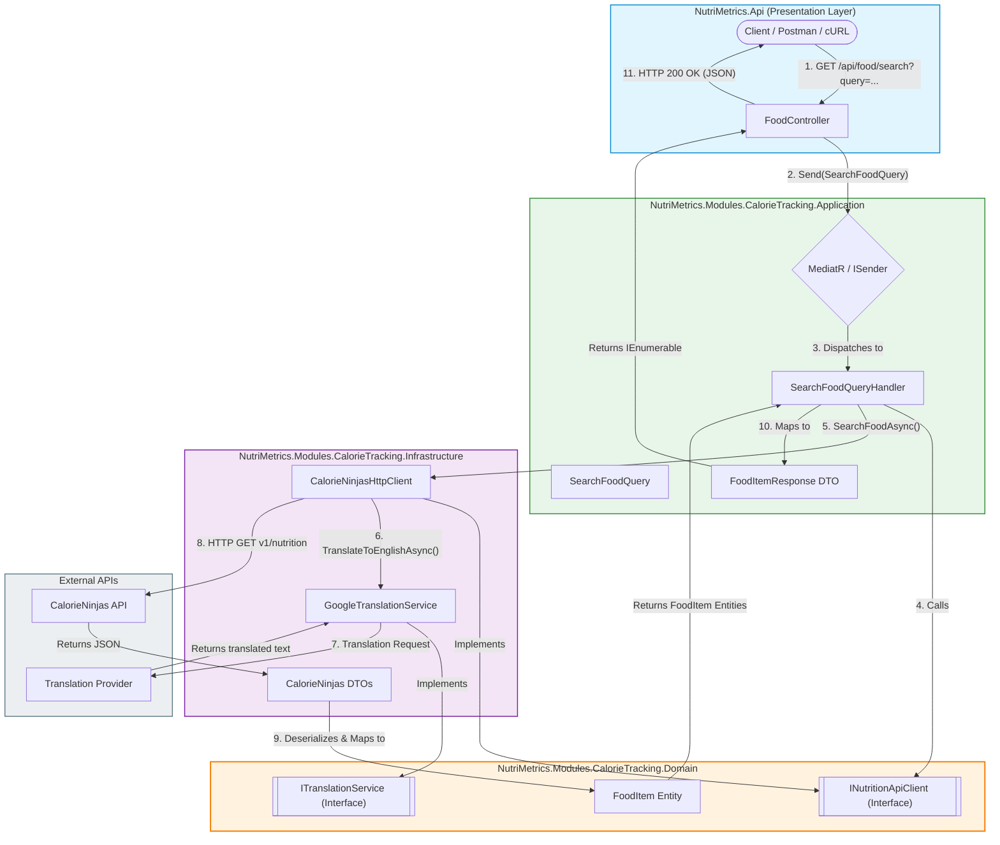

# 🥗 NutriMetrics - Calorie Tracking API

[](https://dotnet.microsoft.com/)
[](#-architecture--clean-design)
[](#-architecture--clean-design)
[](LICENSE)

---

# 📖 Overview

**NutriMetrics** is a modular platform built on **.NET 10** for calorie and nutritional tracking.

This repository currently contains the **Calorie Tracking ** module, exposing a REST API that allows users to search nutritional information using **natural language in Spanish**, for example:

> `2 manzanas y 100g de pechuga de pollo`

The request is automatically translated to English before querying the **CalorieNinjas API**, returning structured nutritional information such as:

- Calories
- Protein
- Fat
- Carbohydrates
- Serving Size

The solution follows **Clean Architecture** and **CQRS**, keeping the domain layer independent from external services.

---

# ✨ Features

- ✅ Search foods using natural language
- ✅ Spanish input support
- ✅ Automatic translation before querying the nutrition provider
- ✅ External Nutrition API integration
- ✅ Clean Architecture
- ✅ CQRS with MediatR
- ✅ Dependency Injection
- ✅ REST API

---

# 🔄 Request Flow

```text
Spanish Query
        │
        ▼
Translation Service
        │
        ▼
CalorieNinjas API
        │
        ▼
Domain Entity
        │
        ▼
Response DTO
        │
        ▼
JSON Response
```

---

# 🏗 Architecture & Clean Design

The project strictly follows **Clean Architecture** and **CQRS**, ensuring the domain core remains completely independent of infrastructure concerns.



---

# 📂 Solution Structure

```text
NUTRI_METRICS/
│
├── src/
│   ├── Modules/
│   │   └── CalorieTracking/
│   │       ├── NutriMetrics.Modules.CalorieTracking.Application/   # CQRS Queries, Handlers & DTOs
│   │       │   └── FoodItems/
│   │       │       └── Queries/
│   │       │           └── SearchFood/
│   │       │               ├── FoodItemResponse.cs
│   │       │               └── SearchFoodQuery.cs
│   │       │
│   │       ├── NutriMetrics.Modules.CalorieTracking.Domain/        # Domain Entities & Interfaces
│   │       └── NutriMetrics.Modules.CalorieTracking.Infrastructure/  # External Services & Client Implementations
│   │
│   ├── NutriMetrics.Api/                                           # Entry Point Host & Presentation Layer
│   │   ├── Controllers/
│   │   │   └── FoodController.cs
│   │   ├── Properties/
│   │   ├── appsettings.Development.json
│   │   ├── appsettings.json
│   │   ├── NutriMetrics.Api.csproj
│   │   ├── NutriMetrics.Api.http
│   │   └── Program.cs
│   │
│   └── Shared/                                                     # Shared Kernel & Infrastructure Assets
│       ├── NutriMetrics.Shared.Domain/
│       └── NutriMetrics.Shared.Infrastructure/
│
└── README.md
```

---

# 📡 API Example

Search foods using natural language.

### Request

```http
GET /api/food/search?query=2 manzanas y 100g de pechuga de pollo
```

### Response

```json
[
  {
    "name": "apple",
    "calories": 94.6,
    "protein": 0.5,
    "fat": 0.3,
    "carbohydrates": 25.1,
    "servingSize": 182
  },
  {
    "name": "chicken breast",
    "calories": 165,
    "protein": 31,
    "fat": 3.6,
    "carbohydrates": 0,
    "servingSize": 100
  }
]
```

> Response values depend on the data returned by the external nutrition provider.

---

# 🔌 External Services

The module communicates with external providers through abstractions defined in the Domain layer.

Current infrastructure implementations:

- GoogleTranslateFreeApi
- CalorieNinjas API

This keeps the application independent from specific providers and allows future implementations without affecting the domain logic.

---

# 🛠 Technology Stack

- .NET 10
- ASP.NET Core Web API

Architecture

- Clean Architecture
- CQRS
- MediatR

Infrastructure

- HttpClient
- Dependency Injection

External Services

- GoogleTranslateFreeApi
- CalorieNinjas API

---

# 🎯 Design Goals

The project aims to demonstrate:

- Modular architecture
- Separation of concerns
- Dependency Inversion Principle
- Infrastructure decoupling
- External API integration
- Maintainable and testable application design

Rather than focusing solely on functionality, the repository showcases architectural practices that can scale as additional modules are introduced.

---

# 📄 License

This project is licensed under the MIT License.