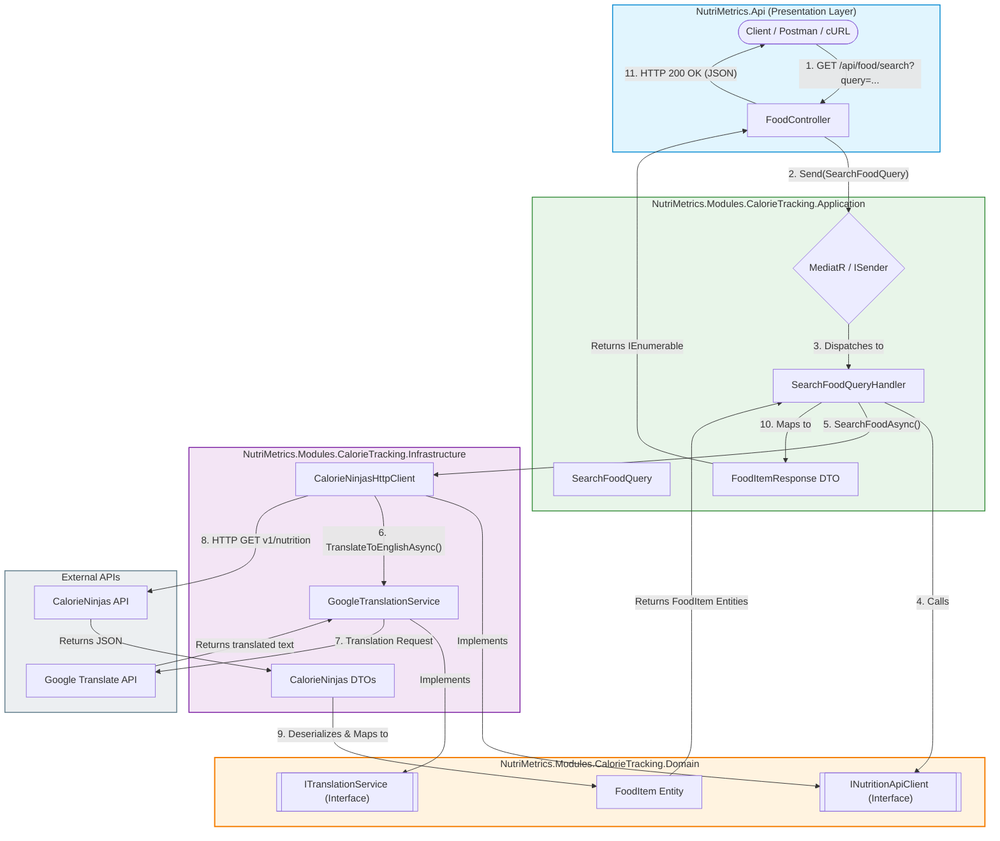

# 🥗 Nutri Metrics Calorie Tracking Module

[](https://dotnet.microsoft.com/)
[](README.md#-architecture)
[](README.md#-architecture)
[](LICENSE)

---

# 📖 Overview

**NutriMetrics** is a modular platform built on **.NET 10** designed for calorie and nutritional tracking.

This repository contains the **CalorieTracking** module, which allows users to search for nutritional information by entering free-text food descriptions in **Spanish** (e.g., *"2 manzanas y 100g de pechuga de pollo"*).

The system seamlessly translates the input query using **GoogleTranslateFreeApi** and queries the **CalorieNinjas** database, returning structured macronutrients (calories, protein, fat, carbohydrates, and serving size) through a decoupled, clean design.

---

# 🏗 Architecture & Clean Design

The project strictly follows **Clean Architecture** principles and **CQRS**, ensuring the domain core remains 100% free of external dependencies.



# 📂 Solution Structure

```text
NUTRI_METRICS/
│
├── src/
│   ├── Modules/
│   │   └── CalorieTracking/
│   │       ├── NutriMetrics.Modules.CalorieTracking.Application/   # CQRS Queries, Handlers & DTOs
│   │       │   └── FoodItems/
│   │       │       └── Queries/
│   │       │           └── SearchFood/
│   │       │               ├── FoodItemResponse.cs
│   │       │               └── SearchFoodQuery.cs
│   │       │
│   │       ├── NutriMetrics.Modules.CalorieTracking.Domain/        # Domain Entities & Interfaces
│   │       └── NutriMetrics.Modules.CalorieTracking.Infrastructure/  # External Services & Client Implementations
│   │
│   ├── NutriMetrics.Api/                                           # Entry Point Host & Presentation Layer
│   │   ├── Controllers/
│   │   │   └── FoodController.cs
│   │   ├── Properties/
│   │   ├── appsettings.Development.json
│   │   ├── appsettings.json
│   │   ├── NutriMetrics.Api.csproj
│   │   ├── NutriMetrics.Api.http
│   │   └── Program.cs
│   │
│   └── Shared/                                                     # Shared Kernel & Infrastructure Assets
│       ├── NutriMetrics.Shared.Domain/
│       └── NutriMetrics.Shared.Infrastructure/
│
├── .gitignore
├── NutriMetrics.slnx
└── README.md