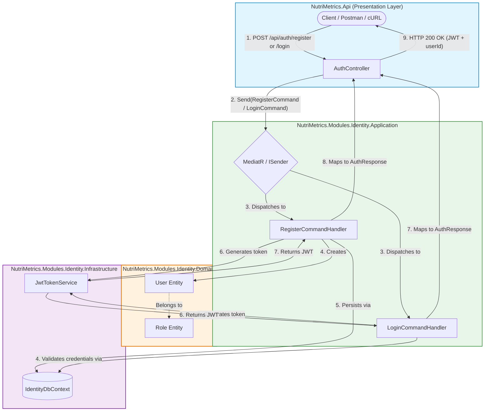
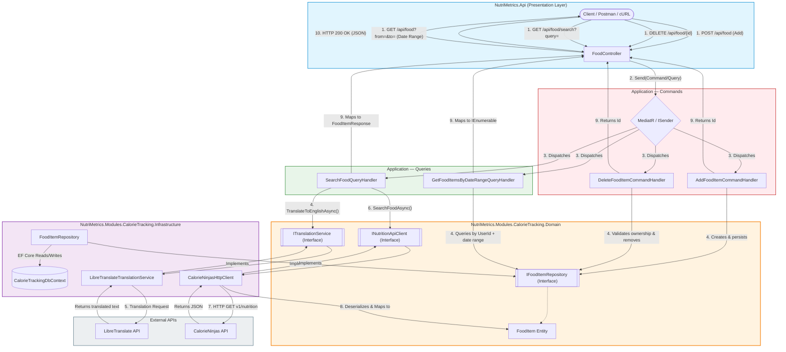
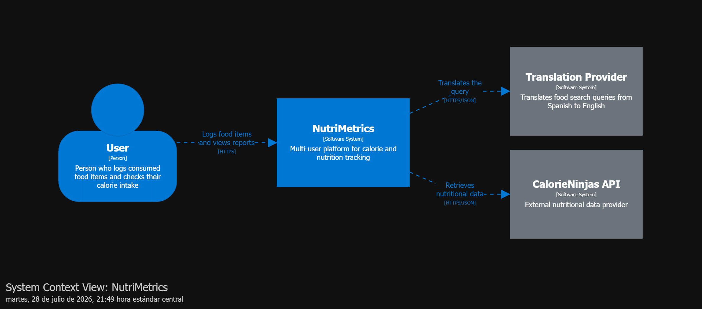
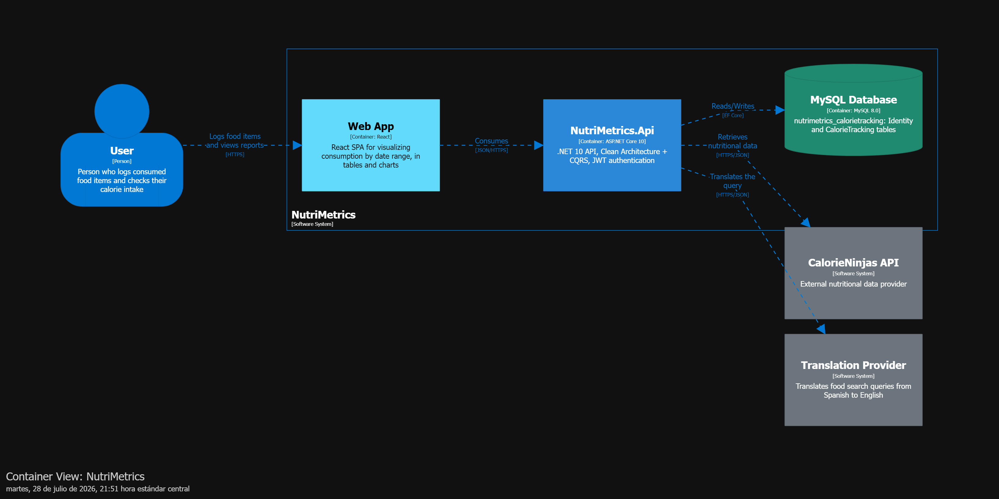
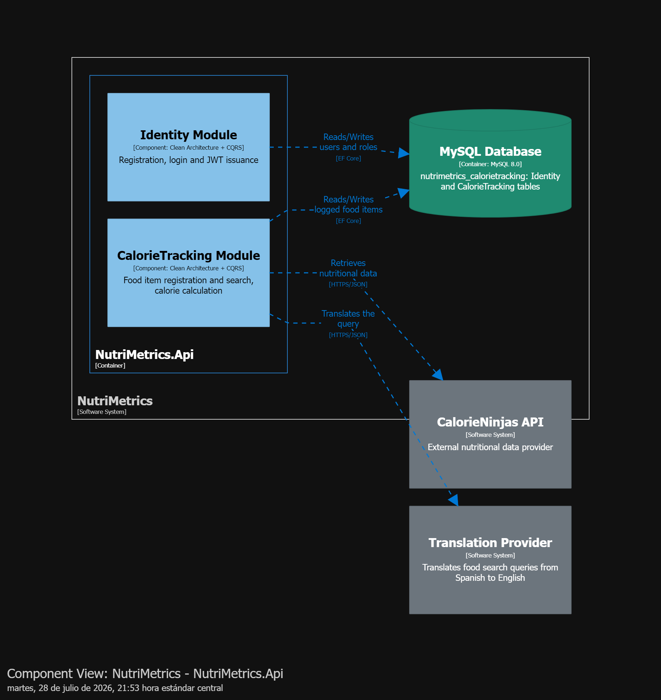

# 🥗 NutriMetrics - Multi-User Calorie Tracking API

[](https://dotnet.microsoft.com/)
[](#architecture--clean-design)
[](#architecture--clean-design)
[](#-authentication--authorization)
[](#-api-documentation-swagger)
[](LICENSE)

---

## 📖 Overview

**NutriMetrics** is a modular, multi-user platform built on **.NET 10** for calorie and nutritional tracking.

### Key Features

- ✅ **Multi-User Support**: Authenticated users with JWT-based authorization
- ✅ **Calorie Tracking**: Search foods by natural language (Spanish support)
- ✅ **Authentication**: Register, login, and JWT token management
- ✅ **Data Isolation**: Each user's data is isolated in the database
- ✅ **Clean Architecture**: Domain-Driven Design with CQRS
- ✅ **Modular**: Separate modules for Identity and CalorieTracking
- ✅ **REST API**: Standards-compliant endpoints with authorization

---

## 🏗 Architecture & Clean Design

The project strictly follows **Clean Architecture** and **CQRS**, ensuring the domain core remains completely independent of infrastructure concerns.

### Design Pattern
- **CQRS + MediatR**: Commands and Queries separation for clear intent
- **Clean Architecture**: Domain → Application → Infrastructure layers
- **Module-Based**: Independent modules with their own layers

### Modules

1. **Identity Module** (`src/Modules/Identity/`)
   - User registration and authentication
   - JWT token generation and validation
   - User and Role management
   - Domain: `User`, `Role` entities
   - Application: `RegisterCommand`, `LoginCommand`
   - Infrastructure: `IdentityDbContext`, `AuthService`, `JwtTokenService`

2. **CalorieTracking Module** (`src/Modules/CalorieTracking/`)
   - Food item management
   - External nutrition API integration
   - Multi-user food tracking
   - Domain: `FoodItem` entity with `UserId`
   - Application: `AddFoodItemCommand`, `SearchFoodQuery`
   - Infrastructure: `CalorieTrackingDbContext`, `CalorieNinjasHttpClient`

### Request Flow — Identity (Register / Login)


```mermaid
graph TD
    subgraph Host["NutriMetrics.Api (Presentation Layer)"]
        Client([Client / Postman / cURL])
        AuthController[AuthController]
    end

    subgraph Application["NutriMetrics.Modules.Identity.Application"]
        Mediator{MediatR / ISender}
        RegisterHandler[RegisterCommandHandler]
        LoginHandler[LoginCommandHandler]
    end

    subgraph Domain["NutriMetrics.Modules.Identity.Domain"]
        UserEntity[User Entity]
        RoleEntity[Role Entity]
    end

    subgraph Infrastructure["NutriMetrics.Modules.Identity.Infrastructure"]
        IdentityDb[(IdentityDbContext)]
        JwtService[JwtTokenService]
    end

    Client -->|"1. POST /api/auth/register or /login"| AuthController
    AuthController -->|"2. Send(RegisterCommand / LoginCommand)"| Mediator
    Mediator -->|"3. Dispatches to"| RegisterHandler
    Mediator -->|"3. Dispatches to"| LoginHandler

    RegisterHandler -->|"4. Creates"| UserEntity
    RegisterHandler -->|"5. Persists via"| IdentityDb
    LoginHandler -->|"4. Validates credentials via"| IdentityDb

    RegisterHandler -->|"6. Generates token"| JwtService
    LoginHandler -->|"5. Generates token"| JwtService

    UserEntity -.->|"Belongs to"| RoleEntity

    JwtService -->|"7. Returns JWT"| RegisterHandler
    JwtService -->|"6. Returns JWT"| LoginHandler
    RegisterHandler -->|"8. Maps to AuthResponse"| AuthController
    LoginHandler -->|"7. Maps to AuthResponse"| AuthController
    AuthController -->|"9. HTTP 200 OK (JWT + userId)"| Client

    classDef host fill:#e1f5fe,stroke:#0288d1,stroke-width:1.5px;
    classDef app fill:#e8f5e9,stroke:#388e3c,stroke-width:1.5px;
    classDef domain fill:#fff3e0,stroke:#f57c00,stroke-width:2px;
    classDef infra fill:#f3e5f5,stroke:#7b1fa2,stroke-width:1.5px;

    class Host host;
    class Application app;
    class Domain domain;
    class Infrastructure infra;
```

### Request Flow — Food Item Tracking (CQRS: Commands & Queries)


```mermaid
graph TD
    subgraph Host["NutriMetrics.Api (Presentation Layer)"]
        Client([Client / Postman / cURL])
        FoodController[FoodController]
    end

    subgraph Commands["Application — Commands"]
        Mediator{MediatR / ISender}
        AddHandler[AddFoodItemCommandHandler]
        DeleteHandler[DeleteFoodItemCommandHandler]
    end

    subgraph Queries["Application — Queries"]
        SearchHandler[SearchFoodQueryHandler]
        DateRangeHandler[GetFoodItemsByDateRangeQueryHandler]
    end

    subgraph Domain["NutriMetrics.Modules.CalorieTracking.Domain"]
        Entity[FoodItem Entity]
        RepoContract[["IFoodItemRepository (Interface)"]]
        NutritionContract[["INutritionApiClient (Interface)"]]
        TranslationContract[["ITranslationService (Interface)"]]
    end

    subgraph Infrastructure["NutriMetrics.Modules.CalorieTracking.Infrastructure"]
        Repository[FoodItemRepository]
        CalorieDb[(CalorieTrackingDbContext)]
        NutritionHttpClient[CalorieNinjasHttpClient]
        TranslateService[LibreTranslateTranslationService]
    end

    subgraph External["External APIs"]
        LibreTranslateAPI["LibreTranslate API"]
        CalorieNinjasAPI["CalorieNinjas API"]
    end

    Client -->|"1. POST /api/food (Add)"| FoodController
    Client -->|"1. DELETE /api/food/{id}"| FoodController
    Client -->|"1. GET /api/food/search?query="| FoodController
    Client -->|"1. GET /api/food?from=&to= (Date Range)"| FoodController

    FoodController -->|"2. Send(Command/Query)"| Mediator
    Mediator -->|"3. Dispatches"| AddHandler
    Mediator -->|"3. Dispatches"| DeleteHandler
    Mediator -->|"3. Dispatches"| SearchHandler
    Mediator -->|"3. Dispatches"| DateRangeHandler

    Repository -->|"Implements"| RepoContract
    NutritionHttpClient -->|"Implements"| NutritionContract
    TranslateService -->|"Implements"| TranslationContract

    AddHandler -->|"4. Creates & persists"| RepoContract
    DeleteHandler -->|"4. Validates ownership & removes"| RepoContract
    DateRangeHandler -->|"4. Queries by UserId + date range"| RepoContract
    RepoContract -.-> Entity

    SearchHandler -->|"4. TranslateToEnglishAsync()"| TranslationContract
    TranslationContract --> TranslateService
    TranslateService -->|"5. Translation Request"| LibreTranslateAPI
    LibreTranslateAPI -->|"Returns translated text"| TranslateService

    SearchHandler -->|"6. SearchFoodAsync()"| NutritionContract
    NutritionContract --> NutritionHttpClient
    NutritionHttpClient -->|"7. HTTP GET v1/nutrition"| CalorieNinjasAPI
    CalorieNinjasAPI -->|"Returns JSON"| NutritionHttpClient
    NutritionHttpClient -->|"8. Deserializes & Maps to"| Entity

    Repository -->|"EF Core Reads/Writes"| CalorieDb

    AddHandler -->|"9. Returns Id"| FoodController
    DeleteHandler -->|"9. Returns Id"| FoodController
    SearchHandler -->|"9. Maps to FoodItemResponse"| FoodController
    DateRangeHandler -->|"9. Maps to IEnumerable<FoodItemResponse>"| FoodController
    FoodController -->|"10. HTTP 200 OK (JSON)"| Client

    classDef host fill:#e1f5fe,stroke:#0288d1,stroke-width:1.5px;
    classDef cmd fill:#ffebee,stroke:#c62828,stroke-width:1.5px;
    classDef qry fill:#e8f5e9,stroke:#388e3c,stroke-width:1.5px;
    classDef domain fill:#fff3e0,stroke:#f57c00,stroke-width:2px;
    classDef infra fill:#f3e5f5,stroke:#7b1fa2,stroke-width:1.5px;
    classDef ext fill:#eceff1,stroke:#607d8b,stroke-width:1.5px;

    class Host host;
    class Commands cmd;
    class Queries qry;
    class Domain domain;
    class Infrastructure infra;
    class External ext;
```

### External Services

The module communicates with external providers through abstractions defined in the Domain layer, keeping the application independent from specific providers:

- **LibreTranslate API** — implements `ITranslationService` (containerized translation service)
- **CalorieNinjas API** — implements `INutritionApiClient`

---

### 🗺️ C4 Model Diagrams

The architecture is documented using the [C4 Model](https://c4model.com/), providing a progressive zoom from system context down to component-level detail. Diagrams were generated with [Structurizr](https://structurizr.com/).

| Level | Diagram | Description |
|-------|---------|--------------|
| **C1 — Context** |  | High-level view of NutriMetrics, its users, and external systems (CalorieNinjas, LibreTranslate API) |
| **C2 — Container** |  | Deployable units: Web App (React), NutriMetrics.Api, and MySQL Database |
| **C3 — Component** |  | Internal components of `NutriMetrics.Api`: Identity Module and CalorieTracking Module |

> Diagram source files (DSL) are available in `docs/diagrams/` and can be edited via [Structurizr Playground](https://playground.structurizr.com/).

---

## 📂 Solution Structure

```text
NUTRI_METRICS/
│
├── docs/                                      # Architecture diagrams and documentation assets
│   └── diagrams/                              # C1/C2/C3 DSL and image files
│
├── src/
│   ├── Modules/
│   │   ├── Identity/
│   │   │   ├── NutriMetrics.Modules.Identity.Application/   # Registration and authentication commands
│   │   │   ├── NutriMetrics.Modules.Identity.Domain/         # User and role entities
│   │   │   └── NutriMetrics.Modules.Identity.Infrastructure/  # Identity services, DbContext, and related infrastructure
│   │   │
│   │   └── CalorieTracking/
│   │       ├── NutriMetrics.Modules.CalorieTracking.Application/   # CQRS handlers, queries, and DTOs
│   │       ├── NutriMetrics.Modules.CalorieTracking.Domain/         # Food item domain models and contracts
│   │       └── NutriMetrics.Modules.CalorieTracking.Infrastructure/  # Repositories, EF configuration, and external integrations
│   │
│   ├── NutriMetrics.Api/                      # API entry point and presentation layer
│   │   ├── Controllers/                      # HTTP controllers for auth and food endpoints
│   │   ├── Extensions/                       # Extension methods and helpers
│   │   ├── Properties/                       # Launch settings and project properties
│   │   ├── appsettings.Development.json
│   │   ├── appsettings.json
│   │   ├── NutriMetrics.Api.csproj
│   │   ├── NutriMetrics.Api.http
│   │   └── Program.cs
│   │
│   ├── Web/                                  # React + Vite frontend (pnpm@9.12.1-managed)
│   │   ├── src/                              # React application source
│   │   │   ├── components/charts/            # Recharts-based chart components
│   │   │   ├── features/auth/                # Authentication (pages, hooks, context, schemas)
│   │   │   ├── features/food-search/         # Food search feature (api, components, hooks)
│   │   │   ├── pages/                        # Page-level views (Dashboard)
│   │   │   ├── routes/                       # App routing (AppRouter, ProtectedRoute)
│   │   │   ├── lib/                          # Shared frontend utilities (httpClient)
│   │   │   ├── App.tsx
│   │   │   ├── main.tsx
│   │   │   └── styles.css
│   │   ├── vite.config.ts                    # Vite config (dev server + API proxy)
│   │   ├── tsconfig.json                     # TypeScript base config
│   │   ├── tsconfig.app.json                 # TypeScript app config
│   │   ├── pnpm-workspace.yaml               # pnpm workspace configuration
│   │   ├── pnpm-lock.yaml                    # Dependency lockfile
│   │   ├── package.json                      # Frontend scripts and deps (react, rhf, router, axios, zod, recharts)
│   │   ├── Dockerfile                        # Frontend container definition (Node + pnpm)
│   │   └── .env.example                      # Frontend environment variables template
│   │
│   └── Shared/                               # Shared domain and infrastructure components
│       ├── NutriMetrics.Shared.Domain/
│       └── NutriMetrics.Shared.Infrastructure/
│
├── LICENSE
├── NutriMetrics.slnx
└── README.md
```

---

## 📚 Architecture Decision Records (ADR)

The project architecture decisions are documented in `docs/adr/`. The table below references the current ADR catalog.

| ADR | File | Summary |
|-----|------|---------|
| ADR-001 | `docs/adr/001-adopt-a-monolith-architecture.md` | Chooses a modular monolith as the current deployment model. |
| ADR-002 | `docs/adr/002-use-clean-architecture.md` | Establishes Clean Architecture with inward dependency flow. |
| ADR-003 | `docs/adr/003-adopt-cqrs.md` | Adopts CQRS to separate write commands from read queries. |

---

## 🗄️ Database Schema

### Single Database: `nutrimetrics_calorietracking`

Both authentication and business logic use the same MySQL database for simplified management and deployment, split into separate `DbContext`s per module.

```sql
-- Identity Tables (created by Identity module)
AspNetUsers          -- User accounts
AspNetRoles          -- User roles
AspNetUserRoles      -- User-Role relationships
AspNetUserClaims     -- User claims
AspNetRoleClaims     -- Role claims
AspNetUserLogins     -- External login providers
AspNetUserTokens     -- Token management

-- Business Tables (created by CalorieTracking module)
FoodItems            -- Tracked food items
```

### Connection String

**File**: `src/NutriMetrics.Api/appsettings.json`

```json
{
  "ConnectionStrings": {
    "Default": "Server=localhost;Port=3306;Database=nutrimetrics_calorietracking;User=root;Password=your_pass_here;"
  }
}
```

Both `IdentityDbContext` and `CalorieTrackingDbContext` use this same connection string.

---

## 🔐 Authentication & Authorization

### Overview

NutriMetrics uses **ASP.NET Core Identity** with **JWT Bearer tokens** for stateless API authentication.

```
Register/Login → JWT Token → Protected Endpoints with [Authorize]
```

### User Registration

**Endpoint**: `POST /api/auth/register`

**Request**:
```json
{
  "email": "user@example.com",
  "password": "SecurePass123",
  "passwordConfirm": "SecurePass123"
}
```

**Response**:
```json
{
  "success": true,
  "message": "User registered successfully",
  "token": "eyJhbGciOiJIUzI1NiIsInR5cCI6IkpXVCJ9...",
  "userId": "550e8400-e29b-41d4-a716-446655440000"
}
```

**Validation**:
- Password minimum 8 characters
- Passwords must match
- Email must be unique

### User Login

**Endpoint**: `POST /api/auth/login`

**Request**:
```json
{
  "email": "user@example.com",
  "password": "SecurePass123"
}
```

**Response**: Same as registration (returns JWT token)

### Token Verification

**Endpoint**: `GET /api/auth/verify` (requires `[Authorize]`)

**Response**:
```json
{
  "userId": "550e8400-e29b-41d4-a716-446655440000",
  "email": "user@example.com"
}
```

### Protected Endpoints

All food-related endpoints require authorization:

```csharp
[Authorize]
[ApiController]
[Route("api/[controller]")]
public class FoodController : ControllerBase { ... }
```

Add the JWT token to requests:
```
Authorization: Bearer <your_jwt_token>
```

### JWT Configuration

**File**: `src/NutriMetrics.Api/appsettings.json`

```json
{
  "Jwt": {
    "Secret": "your-very-long-secret-key-minimum-32-characters-required-change-in-production",
    "Issuer": "NutriMetrics.Api",
    "Audience": "NutriMetrics.Client",
    "ExpirationMinutes": 60
  }
}
```

**Important**:
- Secret must be ≥ 32 characters
- Change the Secret in production
- Token expires after 60 minutes (configurable)

### Token Claims

JWT tokens include:
- `sub` (NameIdentifier): User ID (Guid)
- `email`: User email
- `iat` (IssuedAt): Token creation time
- `exp` (Expiration): Token expiration time

Extract from token in handlers:
```csharp
var userId = httpContext.User.FindFirst(ClaimTypes.NameIdentifier)?.Value;
var email = httpContext.User.FindFirst(ClaimTypes.Email)?.Value;
```

### Password & Lockout Policy

Configured in `IdentityModule.cs`:

- **Password**: minimum 8 characters, no uppercase/digit/special character required, unique emails enforced
- **Lockout**: 5 minute duration, 5 failed attempts before lockout, enabled for new users

---

## 🔍 Multi-User Data Isolation

Each `FoodItem` contains a `UserId` field linking it to the authenticated user.

```csharp
public class FoodItem
{
    public Guid Id { get; private set; }
    public Guid UserId { get; private set; }  // Links to AspNetUsers.Id
    public string Name { get; private set; }
    public double Calories { get; private set; }
    // ... nutritional data
    public DateTime CreatedAt { get; private set; }
}
```

**Handlers automatically extract `UserId` from the JWT**:
```csharp
var userId = httpContext.User.FindFirst(ClaimTypes.NameIdentifier)?.Value;
var foodItem = new FoodItem(userId, name, calories, ...);
```

Queries always filter by the current user:
```csharp
var userFoodItems = await repository.GetByUserAsync(userId, cancellationToken);
```

---

## 🗄️ Entity Framework Core & Migrations

### DbContexts

#### 1. IdentityDbContext
**Location**: `src/Modules/Identity/NutriMetrics.Modules.Identity.Infrastructure/Database/IdentityDbContext.cs`

Manages Identity tables (Users, Roles, Claims, etc.)

```csharp
services.AddDbContext<IdentityDbContext>(options =>
    options.UseMySql(connectionString, serverVersion)
);
```

#### 2. CalorieTrackingDbContext
**Location**: `src/Modules/CalorieTracking/NutriMetrics.Modules.CalorieTracking.Infrastructure/Database/CalorieTrackingDbContext.cs`

Manages business entities (FoodItems, etc.)

```csharp
services.AddDbContext<CalorieTrackingDbContext>(options =>
    options.UseMySql(connectionString, serverVersion)
);
```

### Migrations

Migrations are organized by module:

**Identity**: `src/Modules/Identity/NutriMetrics.Modules.Identity.Infrastructure/Database/Migrations/`
- `20260722004255_InitialIdentity.cs` — Creates AspNetUsers, AspNetRoles tables

**CalorieTracking**: `src/Modules/CalorieTracking/NutriMetrics.Modules.CalorieTracking.Infrastructure/Database/Migrations/`
- `20260721235752_InitialCreate.cs` — Initial schema
- `20260722001501_CreateFoodItemsTable.cs` — FoodItems table
- `20260722004320_AddUserIdToFoodItems.cs` — Adds UserId column for multi-user support

### Creating Migrations

```bash
# CalorieTracking
dotnet ef migrations add MigrationName \
  --project src/Modules/CalorieTracking/NutriMetrics.Modules.CalorieTracking.Infrastructure \
  --startup-project src/NutriMetrics.Api \
  --context CalorieTrackingDbContext

# Identity
dotnet ef migrations add MigrationName \
  --project src/Modules/Identity/NutriMetrics.Modules.Identity.Infrastructure \
  --startup-project src/NutriMetrics.Api \
  --context IdentityDbContext \
  --output-dir Database/Migrations
```

### Applying Migrations

```bash
# CalorieTracking
dotnet ef database update \
  --startup-project src/NutriMetrics.Api \
  --context CalorieTrackingDbContext

# Identity
dotnet ef database update \
  --startup-project src/NutriMetrics.Api \
  --context IdentityDbContext
```

Or apply to a specific migration:
```bash
dotnet ef database update 20260722004255_InitialIdentity \
  --startup-project src/NutriMetrics.Api \
  --context IdentityDbContext
```

### Reverting Migrations

**Remove last migration** (without applying to DB):
```bash
dotnet ef migrations remove \
  --project src/Modules/CalorieTracking/NutriMetrics.Modules.CalorieTracking.Infrastructure \
  --startup-project src/NutriMetrics.Api \
  --context CalorieTrackingDbContext
```

**Revert database** to a previous state:
```bash
dotnet ef database update 20260722001501_CreateFoodItemsTable \
  --startup-project src/NutriMetrics.Api \
  --context CalorieTrackingDbContext
```

### Entity Configuration

Entity configurations use the **Fluent API** in dedicated files under `Database/Configurations/`.

Example — `FoodItemConfiguration`:
```csharp
public class FoodItemConfiguration : IEntityTypeConfiguration<FoodItem>
{
    public void Configure(EntityTypeBuilder<FoodItem> builder)
    {
        builder.HasKey(f => f.Id);
        builder.Property(f => f.UserId).IsRequired();
        builder.HasIndex(f => f.UserId);
        builder.Property(f => f.Name).HasMaxLength(255).IsRequired();
        builder.Property(f => f.CreatedAt)
            .HasDefaultValueSql("CURRENT_TIMESTAMP(6)");
    }
}
```

### Key EF Core Features Used

| Feature | Usage |
|---------|-------|
| **Value Objects** | DateTime defaults with `HasDefaultValueSql` |
| **Fluent API** | Entity configurations in dedicated files |
| **Indexes** | `HasIndex(f => f.UserId)` for query performance |
| **Foreign Keys** | Identity relationships (implicit) |
| **Seeding** | Could be added in migrations if needed |
| **Change Tracking** | Automatic timestamp updates |

---

## 🚀 Getting Started

### Prerequisites

- **Docker Desktop** (or Docker Engine + Compose)
- **.NET SDK 10.0** or higher (for local non-container runs and tests)
- **PowerShell** or **Bash** terminal

### Option A: Docker (Recommended)

1. **Clone the repository**
  ```bash
  git clone https://github.com/yourusername/nutri_metrics.git
  cd nutri_metrics
  ```

2. **Create environment file from template**
  ```bash
  cp .env.example .env
  ```

  On PowerShell, use:
  ```powershell
  Copy-Item .env.example .env
  ```

3. **Set secure values** in `.env` (at minimum `MYSQL_ROOT_PASSWORD`, `JWT_SECRET`, `CALORIE_NINJAS_API_KEY`)

4. **Start local profile** (Web + API + MySQL + LibreTranslate)
  ```bash
  docker compose up --build -d
  ```

  Frontend dependencies are resolved with `pnpm` inside containers. No `npm install` step is required.

5. **Verify API**
  - Frontend (Vite): `http://localhost:5173`
  - API base URL: `http://localhost:8080`
  - Swagger (Development profile): `http://localhost:8080/swagger`

6. **Stop stack**
  ```bash
  docker compose down
  ```

### Option B: Production-like Docker Profile

Use this profile to validate production-oriented behavior with environment-based secrets.

```bash
docker compose -f docker-compose.yml -f docker-compose.prod.yml up --build -d
```

Stop it with:

```bash
docker compose -f docker-compose.yml -f docker-compose.prod.yml down
```

### Option C: Run Without Docker

1. Configure local MySQL and set `ConnectionStrings:Default`.
2. Configure secrets with user-secrets or environment variables.
3. Run:
  ```bash
  dotnet run --project src/NutriMetrics.Api/NutriMetrics.Api.csproj
  ```

---

## 🔐 Secrets Management

This project currently uses `UserSecretsId` in the API project for local development.

- `dotnet user-secrets` works for local non-container runs.
- `dotnet user-secrets` does **not** flow automatically into Docker containers.
- Containers use environment variables from `.env` and Compose mappings.

Sensitive keys expected at runtime:

- `ConnectionStrings__Default`
- `Jwt__Secret`
- `Jwt__Issuer`
- `Jwt__Audience`
- `Jwt__ExpirationMinutes`
- `CalorieNinjas__ApiKey`
- `Http__UseHttpsRedirection` (set to `false` for HTTP-only container runs)

Do not commit real values to source control.

---

## 🗃️ Database Initialization In Containers

At startup, the API now:

1. Applies EF Core migrations for **IdentityDbContext**
2. Applies EF Core migrations for **CalorieTrackingDbContext**
3. Optionally seeds an initial test API user (idempotent)

Seed configuration keys:

- `Seed__EnableTestUser`
- `Seed__TestUser__Email`
- `Seed__TestUser__Password`

Recommended:

- Enable seed only in local/dev and dedicated test environments.
- Disable seed by default in production-like environments.

---

## 🧪 Testing Strategy (Unit / Integration / E2E)

The repository now includes three test projects with a first executable baseline for FoodController-related scenarios:

- `tests/NutriMetrics.Modules.CalorieTracking.Application.Tests`
- `tests/NutriMetrics.Api.IntegrationTests`
- `tests/NutriMetrics.Api.E2eTests`

### Unit Tests (Application + Controller Behavior)

Focus on `FoodController` and its related handlers:

- `POST /api/food` validation and command dispatch
- `GET /api/food/search` query validation and dispatch
- `GET /api/food/by-date-range` user claim/date-range validation
- `DELETE /api/food/{id}` user claim extraction and command dispatch

Critical unit scenarios:

- Unauthorized when `ClaimTypes.NameIdentifier` is missing/invalid
- Bad request for empty food name and invalid date range
- Correct command/query dispatch through MediatR

### Integration Tests (API + In-Memory Database)

Current integration tests use `WebApplicationFactory` plus in-memory EF Core providers to validate API pipeline behavior deterministically:

- Authenticated flow: login/register then Food endpoints
- Endpoint authorization behavior for FoodController
- Request/response flow through MediatR handlers

For real MySQL verification, use the Docker smoke and E2E steps below.

### E2E Tests (Full Docker Stack)

Validate full journey against running Compose stack:

1. Register/Login
2. Add food item
3. Search nutrition data
4. Query by date range
5. Delete food item

This E2E scope is explicitly based on `FoodController` behavior and JWT-protected routes.

### Build & Verification Commands

```bash
# Build solution
dotnet build

# Unit tests
dotnet test tests/NutriMetrics.Modules.CalorieTracking.Application.Tests/NutriMetrics.Modules.CalorieTracking.Application.Tests.csproj

# Integration tests
dotnet test tests/NutriMetrics.Api.IntegrationTests/NutriMetrics.Api.IntegrationTests.csproj

# Start local docker stack
docker compose up --build -d

# E2E tests against Docker stack
NUTRIMETRICS_E2E_BASE_URL=http://localhost:8080 dotnet test tests/NutriMetrics.Api.E2eTests/NutriMetrics.Api.E2eTests.csproj

# Stop local docker stack
docker compose down
```

---

## 📊 API Endpoints

### Authentication
```
POST   /api/auth/register   - Register new user
POST   /api/auth/login      - Login and get JWT token
GET    /api/auth/verify     - Verify token validity [Authorize]
```

### Food Items
```
POST   /api/food            - Add food item [Authorize]
GET    /api/food/search?q=  - Search foods by query [Authorize]
```

### Example — Search Food

**Request**
```http
GET /api/food/search?query=2 manzanas y 100g de pechuga de pollo
```

**Response**
```json
[
  {
    "name": "apple",
    "calories": 94.6,
    "protein": 0.5,
    "fat": 0.3,
    "carbohydrates": 25.1,
    "servingSize": 182
  },
  {
    "name": "chicken breast",
    "calories": 165,
    "protein": 31,
    "fat": 3.6,
    "carbohydrates": 0,
    "servingSize": 100
  }
]
```

> Response values depend on the data returned by the external nutrition provider.

---

## 📝 Full Configuration Reference

```json
{
  "ConnectionStrings": {
    "Default": "Server=localhost;Port=3306;Database=nutrimetrics_calorietracking;User=root;Password=your_pass_here;"
  },
  "Jwt": {
    "Secret": "your-very-long-secret-key-minimum-32-characters-required-change-in-production",
    "Issuer": "NutriMetrics.Api",
    "Audience": "NutriMetrics.Client",
    "ExpirationMinutes": 60
  },
  "CalorieNinjas": {
    "ApiKey": "YOUR_CALORIE_NINJAS_API_KEY_HERE"
  },
  "Logging": {
    "LogLevel": {
      "Default": "Information",
      "Microsoft.AspNetCore": "Warning"
    }
  }
}
```

---

## 🔗 Dependencies

**Core Framework**
- ASP.NET Core 10.0
- Entity Framework Core 8.0.2
- Pomelo.EntityFrameworkCore.MySql 8.0.2

**Authentication**
- Microsoft.AspNetCore.Identity.EntityFrameworkCore 8.0.2
- System.IdentityModel.Tokens.Jwt 8.14.0

**Business Logic**
- MediatR 14.2.0 (CQRS pattern)
- MediatR.Extensions.Microsoft.DependencyInjection

**External APIs**
- HttpClientFactory (built-in)
- CalorieNinjas Nutrition API
- LibreTranslate API

### Security Note on Dependencies

- `Newtonsoft.Json` and `Microsoft.Extensions.Caching.Memory` were explicitly upgraded to newer safe versions through project/package overrides.
- OpenAPI generation was migrated to the Swashbuckle stack, keeping Swagger UI while removing the previously vulnerable dependency chain from this project.

---

## 📘 API Documentation (Swagger)

The project exposes interactive API documentation through **Swagger UI**, generated from the native .NET 10 OpenAPI document.

Available **in the development environment only**.

### Access

With the project running (`dotnet run --project src/NutriMetrics.Api/NutriMetrics.Api.csproj`), open in your browser: http://localhost:[port]/swagger (example http://localhost:5162/swagger)

From there you can:

- View all available endpoints, grouped by controller
- Try out requests directly from the browser
- Inspect the request/response models for each endpoint

### Authentication in Swagger UI

Endpoints protected with `[Authorize]` require a valid JWT. To test them from Swagger:

1. Log in via `POST /api/auth/login` (or register with `POST /api/auth/register`) and copy the `token` from the response
2. Click **Authorize** 🔒 at the top of the interface
3. Paste the token (without the `Bearer ` prefix) and confirm
4. From then on, all protected requests are executed with that token

The raw OpenAPI document (JSON) is also available directly at:
http://localhost:[port]/openapi/v1.json (example http://localhost:5162/openapi/v1.json)

---
## 🎯 Design Goals

The project aims to demonstrate:

- Modular architecture
- Separation of concerns
- Dependency Inversion Principle
- Infrastructure decoupling
- External API integration
- Maintainable and testable application design

Rather than focusing solely on functionality, the repository showcases architectural practices that can scale as additional modules are introduced.

---

## 📄 License

This project is licensed under the MIT License - see [LICENSE](LICENSE) file for details.

---

**Last Updated**: July 2026
**Version**: 1.0.0 (Multi-User with JWT Authentication)